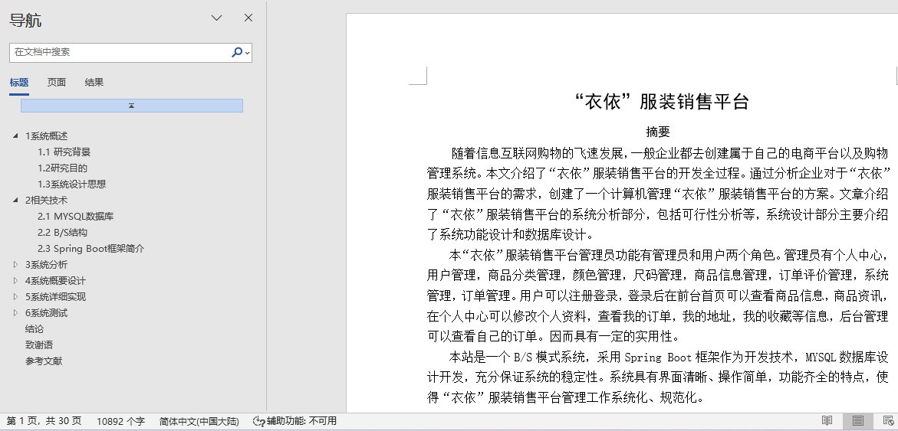
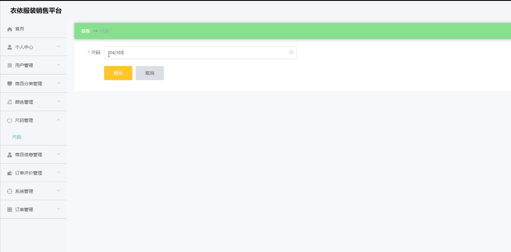
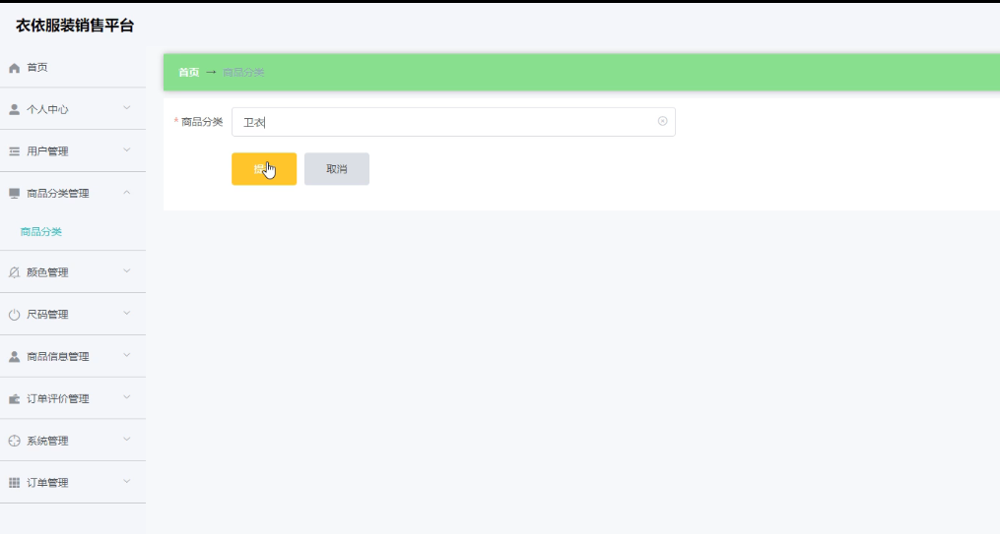
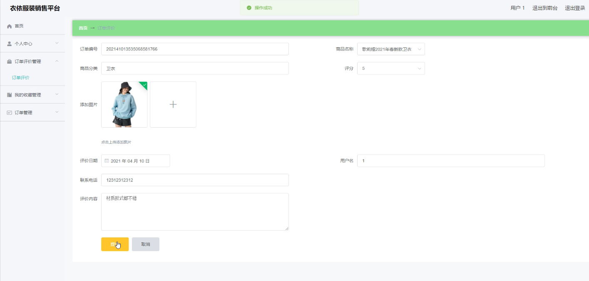
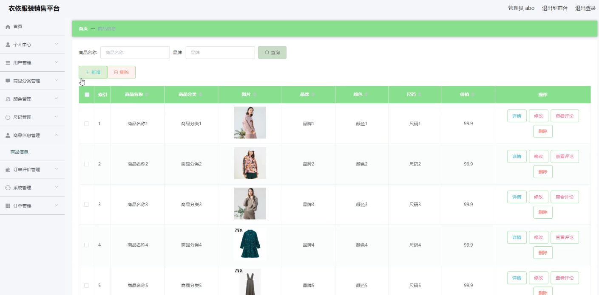

## 基于springboot的衣依服装销售平台(程序+报告)

###  获取sql数据库文件: 从戎源码网 (https://armycodes.com/) QQ: 386869957 QQ群: 377586148
###  所有系统地址: (https://github.com/YuLin-Coder/AllProjectCatalog) 
###  所有项目以及源代码本人均调试运行无问题 可支持远程安装部署调试、定制修改、代码讲解

## 项目介绍
基于springboot的衣依服装销售平台，系统包含两种角色：用户、管理员，系统分为前台和后台两大模块，主要功能如下：

### 【管理员】:
商品信息管理  
系统管理员可以管理平台上的商品信息，包括添加、修改、删除商品信息。

尺码信息管理  
系统管理员可以对商品的尺码信息进行添加、修改、删除操作。

商品分类管理  
系统管理员可以对商品分类进行管理，包括添加、修改、删除商品分类。

### 【用户】:
首页  
用户登录后可以查看首页，首页上显示商品新闻和推荐商品。

商品信息  
用户登录后，点击商品，可以查看商品的详细信息并进行购买操作。

购买商品订单管理  
用户登录后可以在个人后台查看和管理自己的购买商品订单。

## 项目技术
- 编程语言：Java
- 数据库：MySQL
- 项目管理工具：Maven
- 前端技术：HTML、CSS、JavaScript、Jquery、Vue
- 后端技术：Spring、SpringMVC、MyBatis

## 运行环境
- JDK版本：JDK1.8及以上
- 开发工具：IDEA、Ecplise、Myecplise都可以
- 数据库: MySQL5.7及以上
- Maven：maven3.0及以上
- Node：14.14.0及以上

## 运行截图

